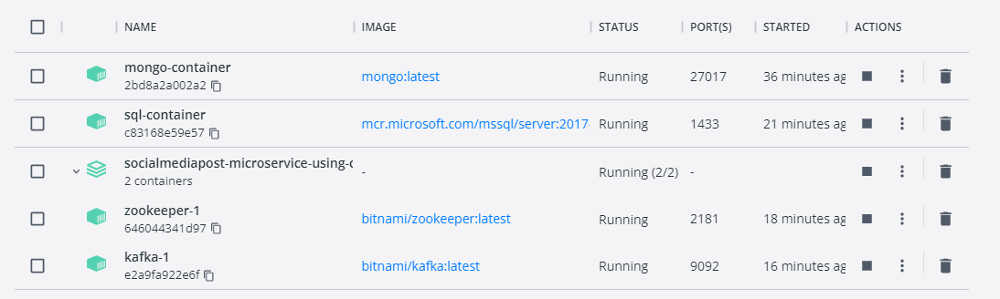

# SocialMediaPost-Microservice-using-CQRS-EventSourcing-and-Kafka
A Server-side project for a social media post microservice that is implemented using CQRS, Event Sourcing, MediatR, and Kafka for the event architecture pattern.

# The Environment Setup for running this application
## `1- Running Kafka`
- open Docker Desktop 

  <br>

- download the `docker-compose.yml` that i have uploaded.

<br>

- run the following command to create a network to add the all up-coming services into it.
  ``` cmd
  >> docker network create --attachable -d bridge post_service_network
  ```
   the above command will create a network named `bridge`. 

<br>

- run the following command to spin up an instance of kafka and zookeeper services.
   ```cmd
   >> docker-compose up -d
   ```

<br>

- run the following command to spin up an instance of mongodb database in docker.
  ```cmd
  >> docker run -it -d --name mongo-container -p 27017:27017 --network post_service_network --restart always -v mongodb_data_container:/data/db mongo:latest
  ```

<br>

- run the following command to spin up an instance of sql server database in docker.
- I will use sql server as my read database.
  ```cmd
  >> docker run --name sql-container --network post_service_network --restart always -e 'ACCEPT_EULA=Y' -e 'SA_PASSWORD=$tr0ngs@p@ssw0rd012' -e 'MSSQL_PID=Express' -p 1433:1433 -d mcr.microsoft.com/mssql/server:2017-latest-ubuntu
  ```

